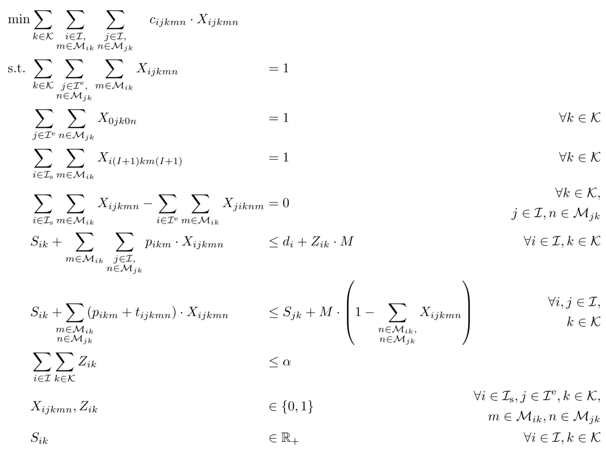
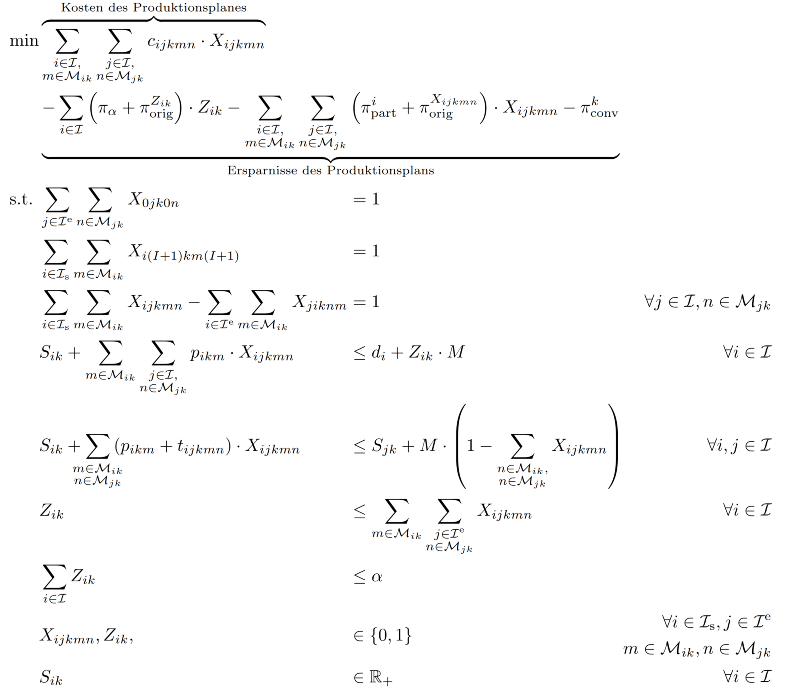

# Hausarbeit
## Modelldefinition PHALS
# Natation

|Indizes und Mengen          |                                                                                  |
| --------------------------------------------------- | ------------------------------------------------------- |
|$i,j \ \ \in \mathcal{I}$                            | Menge der Coils                                         |       
|$i,j \ \ \in \mathcal{I}_s$                          | Menge der Coils mit Startcoil                           |       
|$i,j \ \ \in \mathcal{I}^e$                          | Menge der Coils mit Endcoil                             |       
|$i,j \ \ \in \mathcal{I}^e_s$                       | Menge der Coils mit Start- und Endcoil                  |       
|$k \in \mathcal{K}$  				      | Menge der parallelen Linien                             |
|$m \in \mathcal{M_{ik}},~n \in \mathcal{M_{jk}}$    | Menge der möglichen Modi für Coil i und j auf Linie k   |

|Parameter                                            |                                                         |
| --------------------------------------------------- | ------------------------------------------------------- |
|$p_{ikm}$                                            | Bearbeitungsdauer von Coil i auf der Linie k in Modus m |
|$\alpha$                                             | Maximale Anzahl an verspäteten Coils                    |
|$d_i$                                                | Fälligkeitsdatum von Coil i                             |
|$c_{ijkmn}$                                          | Kosten für einen Stringer zwischen Coil i in Modus m und Coil |
|$t_{ijkm}$                                          |Bearbeitungsdauer von einem Stringer zwischen Coil i in Modus |

|Entscheidungsparameter                               |                                                         |
| --------------------------------------------------- | ------------------------------------------------------- |
| $X_{p,ijmn}$                            	      |  1, wenn Coil i in Modus m direkt vor Coil j in Modus n auf der Linie k produziert wird, 0 sonst |
| $x^k_{p,ijmn}$                            	      |  $X_{p,ijmn}$ je Fertigungslinie im Master             |
| $\lambda^k_p$                                       | 1, wenn Muster ausgewählt				|
| $Z_{ik} \in \{0,1\}$                                 | 1, wenn Coil i Verspätung hat, 0 sonst                  |
| $z^k_{i} \in \{0,1\}$                               |  $Z_{i} \in \{0,1\}$  je Fertigungslinie im Master                                                 |                                
| $S_{ik} \geq 0$                                        | Startzeit der Bearbeitung von Coil i                    |

|Dual Variablen                             |                                                         |
| --------------------------------------------------- | ------------------------------------------------------- |
|$\pi_{\alpha}$                                 | Dual $\alpha$ Beschränkung                                                   |
|$\pi^{Z_{ik}}_\text{orig}$                                 | Dual Z Grundbediengung                                                 |
|$\pi^{i}_\text{part}$                                 |  Dual  Muster                                                |
|$\pi^{X_{ijkmn}}_\text{orig}$                                 | Dual X Grundbediengung                                                   |
|$\pi^{k}_\text{conv}$                                 |  Dual Convexification                                                  |
## Master

## Pricer

